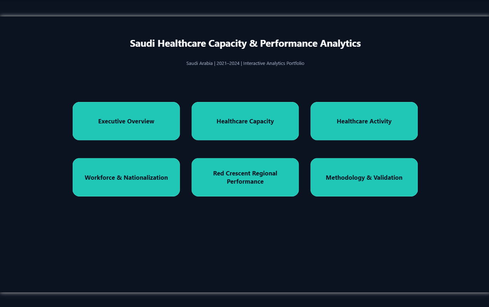
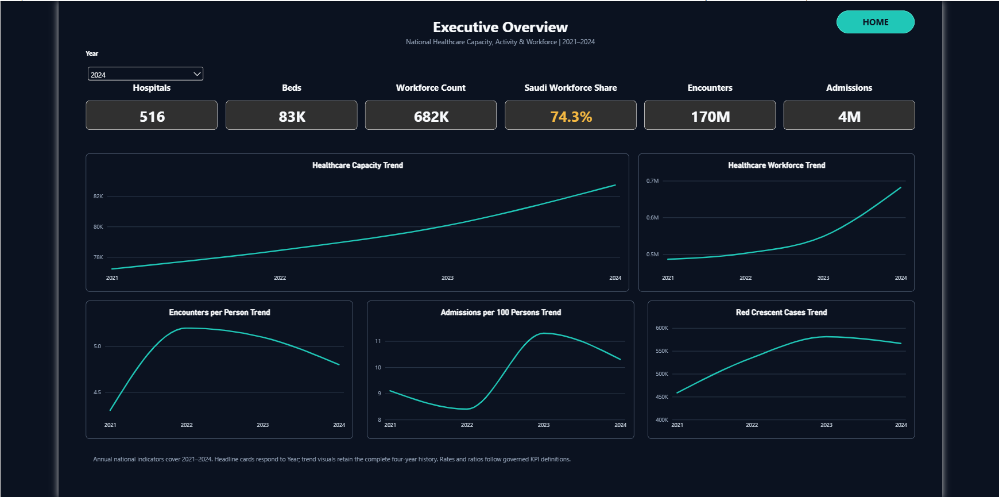
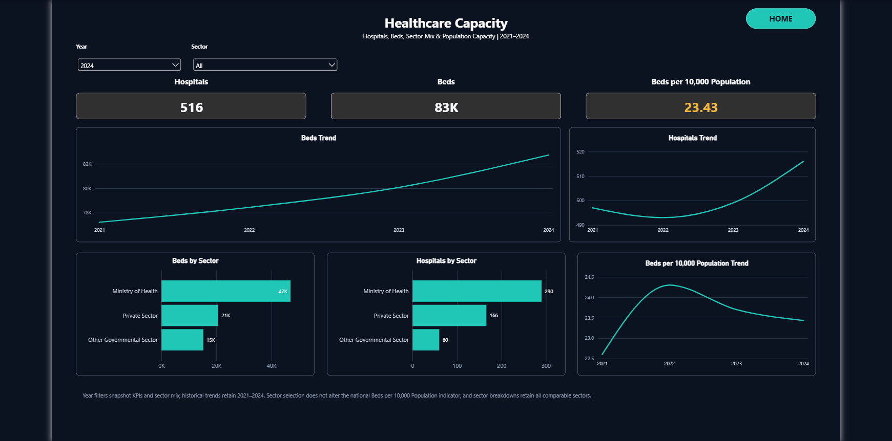
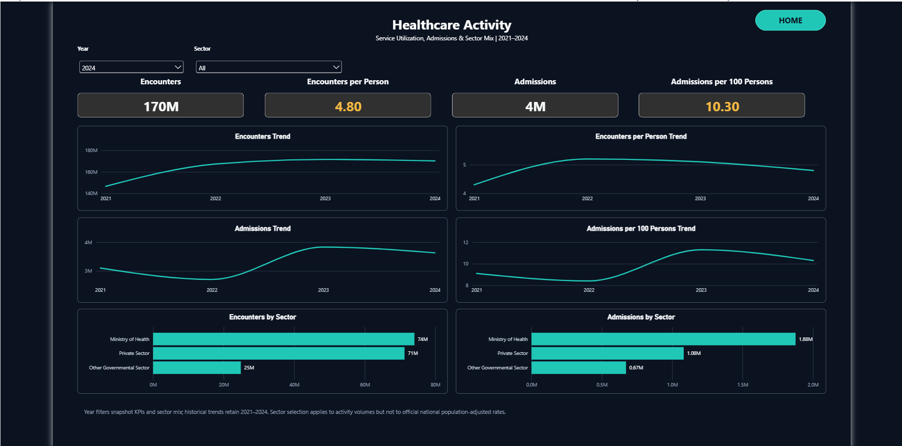
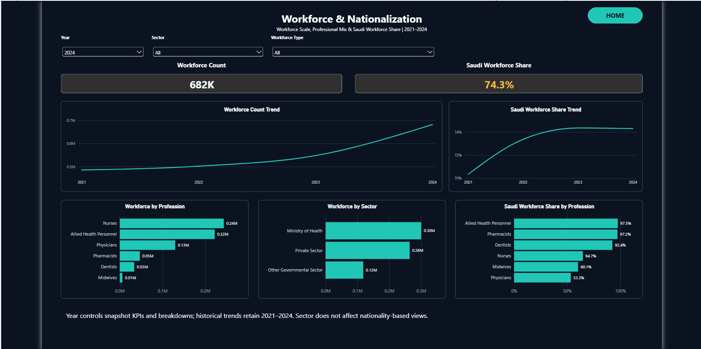
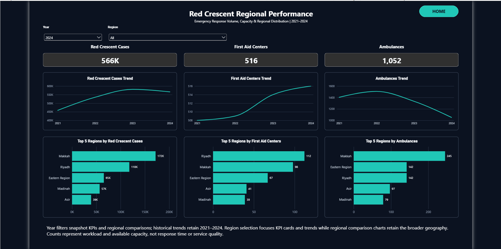
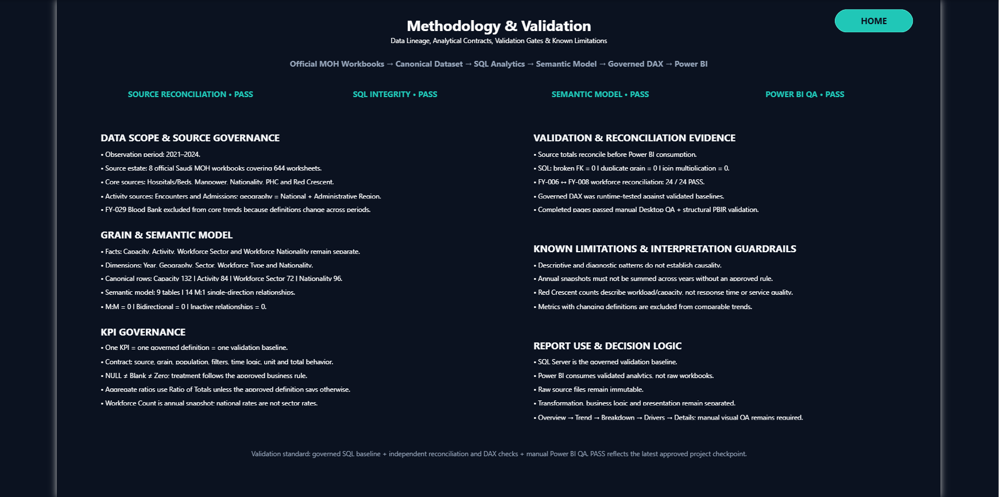

# Dashboard gallery

Genuine captures of the approved Power BI report, visually inspected for release. Pixels are unchanged; filenames were standardized. These are static screenshots, not live embedded dashboards. Analytical captures show 2024; each page describes its filter behavior.

## 00 — INDEX

Navigation to the six report pages; the saved project opens here.

## 01 — Executive Overview

National capacity, activity and workforce headlines with historical trends.

## 02 — Healthcare Capacity

Hospitals, beds, sector mix and official national population-adjusted rates.

## 03 — Healthcare Activity

Encounters, admissions, sector composition and national service-use rates.

## 04 — Workforce & Nationalization

Annual workforce by sector/profession and Saudi workforce share for MOH Total.

## 05 — Red Crescent Regional Performance

Cases, centers, ambulances and regional concentration. Counts do not measure response time or service quality.

## 06 — Methodology & Validation

Source scope, contracts, reconciliation and interpretation guardrails. The “9 tables” label counts SQL business tables; the measure table brings the total to ten. PASS labels summarize approved checkpoints; see [release evidence](../docs/validation/FINAL_RELEASE_VALIDATION.md).

